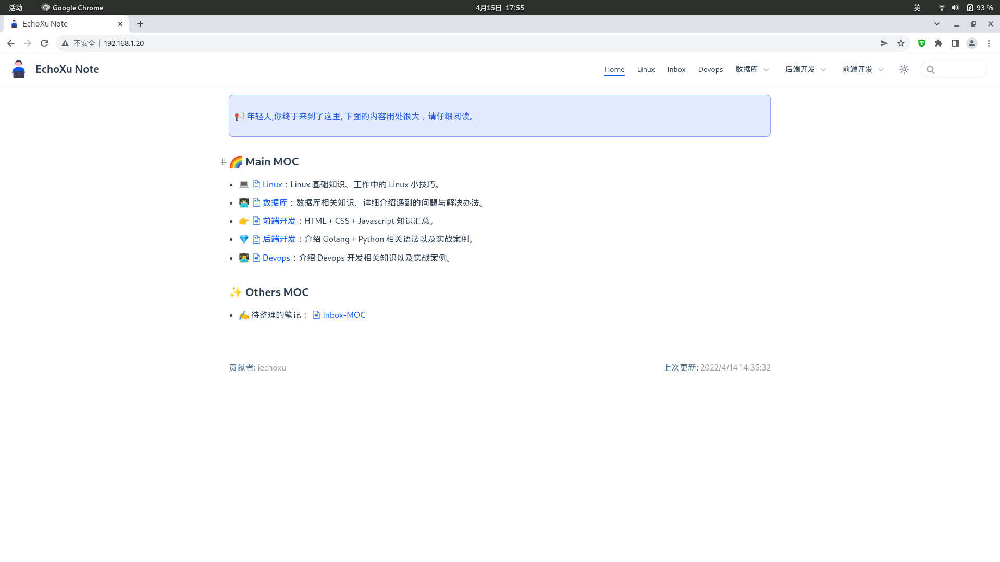
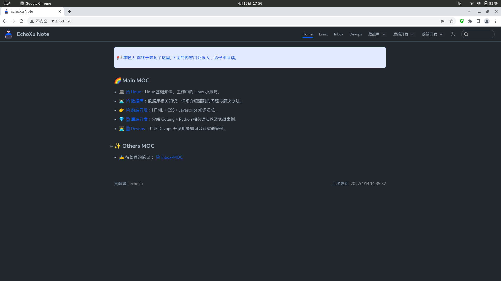
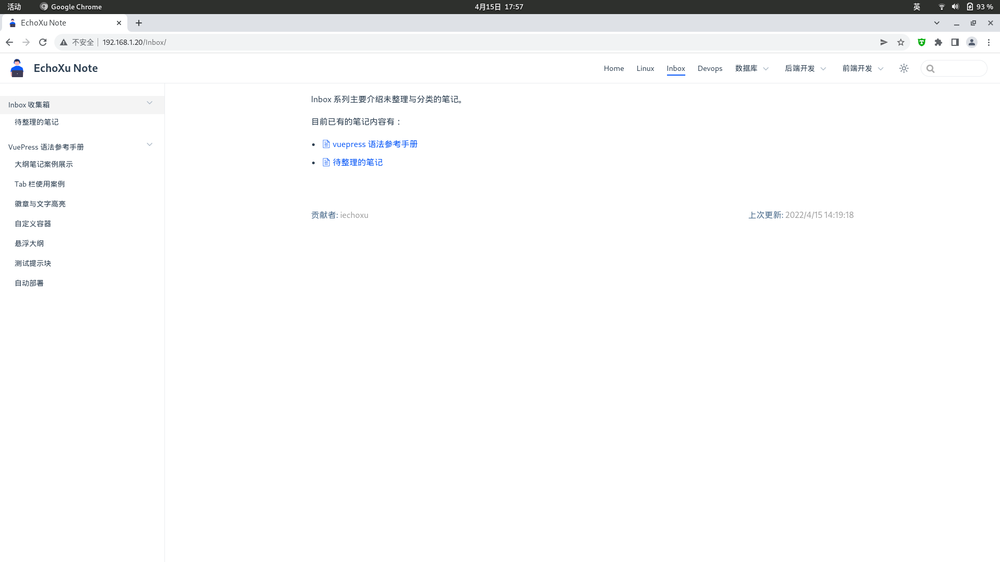
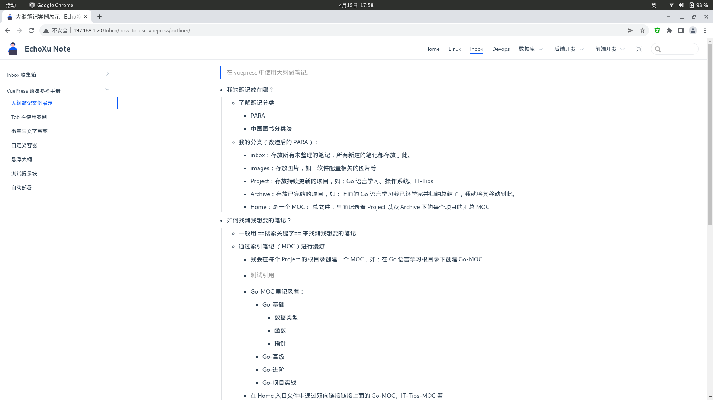
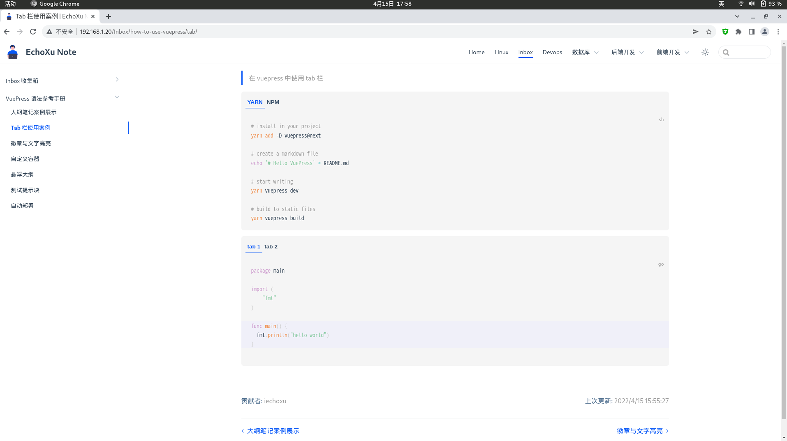
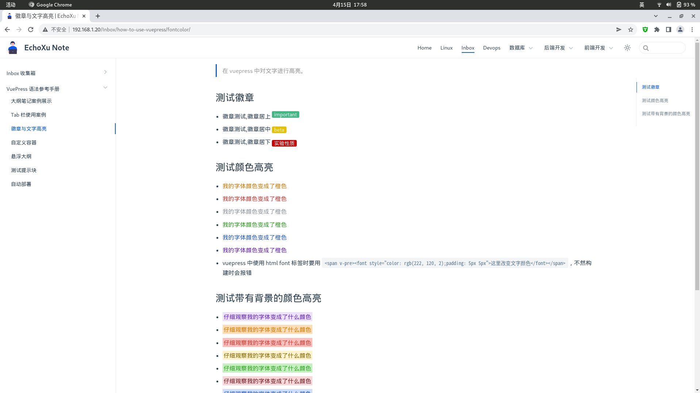
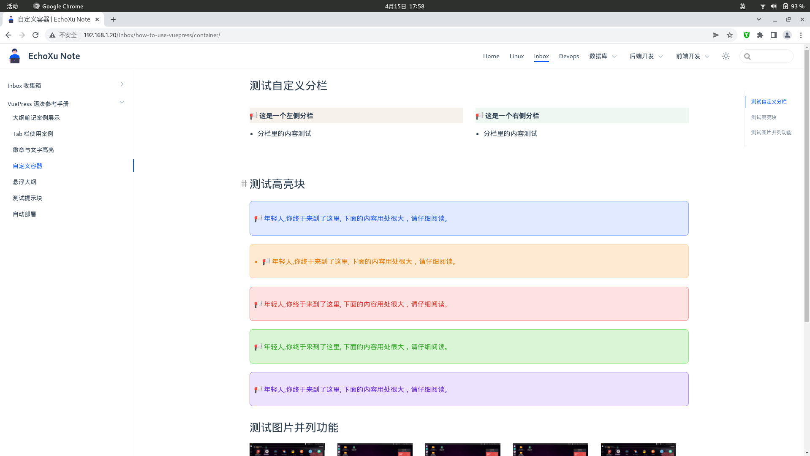
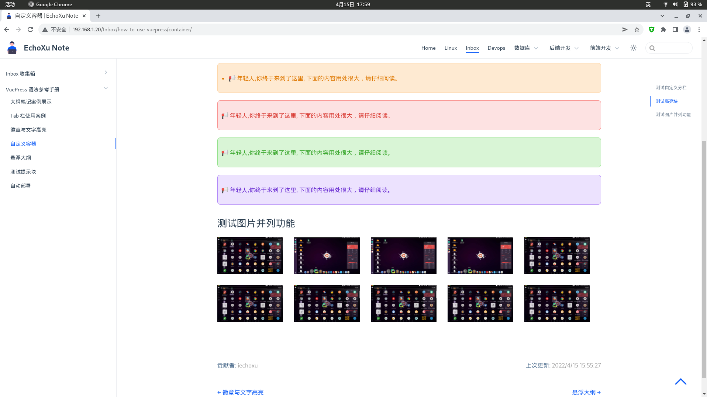
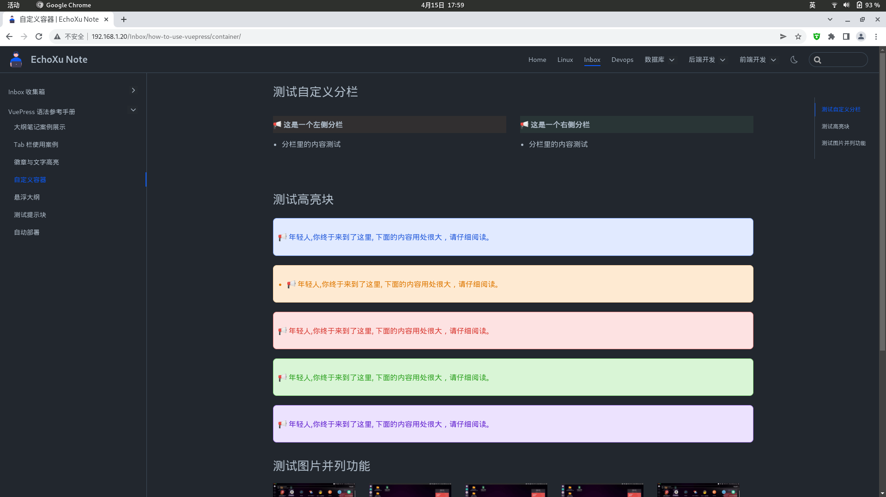
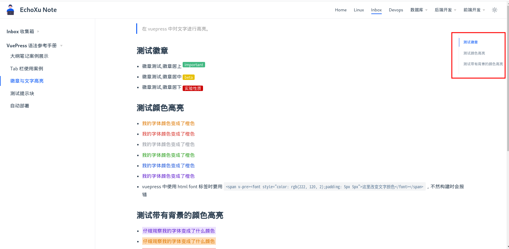

# vstyles 使用方法

这个项目是我用于修改 vuepress 默认主题样式的，如果你喜欢这个项目并想使用它，可参考如下内容：

## 如何使用？

- 将你的 `manifest.webmanifest`、`facvicon` 放置在 `/docs/.vuepress/public` 目录下
- 进入项目根目录，和 package.json 同级目录，然后执行 `yarn install` 可安装项目依赖包
- config 目录下的 sidebarConf.js 是生成侧边栏所需的文件，你可依照里面的内容进行修改
- config 目录下的 navConf.js 是生成顶部菜单的文件，须自行修改
- config 目录下的 headConf.js 是有关 serviceWorker 以及网站 facvicon 所用到的文件，你需要修改此处
- config 目录下的 pluginConf.js 我安装的插件配置项，里面列举的插件推荐全部安装，自定义的容器（如：高亮块、图片并列显示等容器）定义也在此处进行配置
- 使用案例全部放在了 `docs/Inbox/vuepress案例展示` 下，推荐查看

## 效果展示

