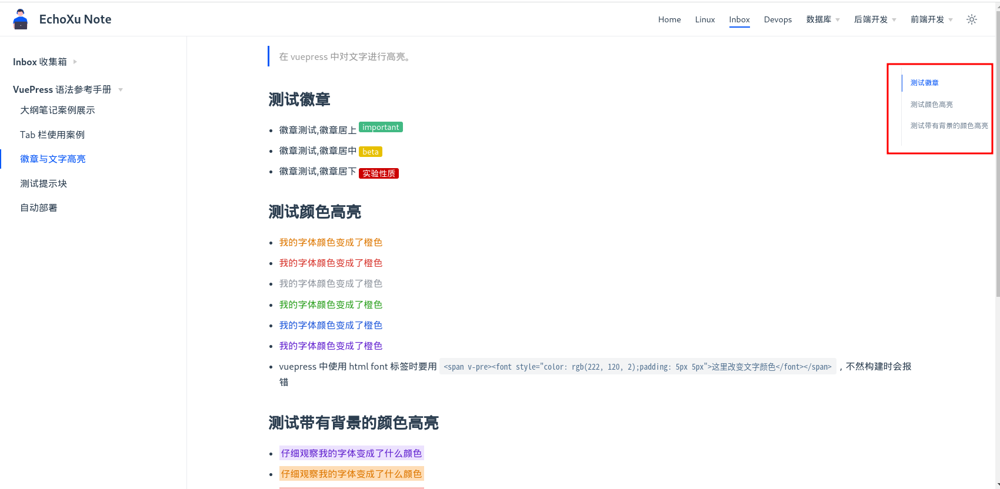

> 在 vuepress2 中添加 vuepress-plugin-right-anchor 插件，因为这个插件还没发布到 npm 中，所以需要手动编译安装。

## 准备

- 去 [vuepress-plugin-right-anchor](https://github.com/xuekai-china/vuepress-plugin-right-anchor) 下载插件
- 将你原来的 vuepress 目录复制如下内容：
  - docs 目录，但不要包含 `.vuepress/{.cache,.temp}` 这两个文件
  - deploy.sh 文件
  - .gitignore 文件
  - 如果有额外的 config 配置目录也要包含进去
  - package.json 文件内容如下：
  - ```bash
    {
        "name": "vuepress",
        "version": "1.0.0",
        "main": "index.js",
        "license": "MIT",
        "devDependencies": {
            "@vue/component-compiler-utils": "^3.3.0",
            "@vuepress/plugin-search": "^1.9.7",
            "@vuepress/shared-utils": "^1.9.7",
            "lru-cache": "^7.8.1",
            "vuepress": "^2.0.0-beta.39",
            "vuepress-plugin-right-anchor": "file:right-anchor"
        },
        "scripts": {
            "docs:dev": "vuepress dev docs",
            "docs:build": "vuepress build docs",
            "deploy": "bash deploy.sh"
        }
    }
    ```
  - vuepress 配置文件 config.js 内容如下：
  - ```js{23,50-63}
    const navConf = require('../../config/navConf.js');
    // const pluginConf = require('../../config/pluginConf.js');
    const sidebarConf = require('../../config/sidebarConf.js');
    const headConf = require('../../config/headConf.js');
    // const secretKeyConf = require('../../config/secretKeyConf');
    module.exports = {
        lang: 'zh-CN',
        title: 'EchoXu Note',
        description: 'ENote 是一个记录 IT 知识点的文档生成器。IT 知识，文档管理，文档记录，文档生成器',
        // base: '/v2/',  // 部署时如果地址是：https://192.168.1.20/v2  这里的路径就要写为 /v2/ 如果是 / 就需要注释此项。
        head: headConf,
        // plugins: pluginConf,

        // theme: '@vuepress/theme-default',
        themeConfig: {
            logo: '/favicon.svg',

            docsDir: 'docs',

            navbar: navConf,

            sidebar: sidebarConf,
            sidebarDepth: 0,

            lastUpdatedText: '上次更新',
            contributorsText: '贡献者',

            tip: '提示',
            warning: '注意',
            danger: '警告',

            // 404 page
            notFound: [
                '这里什么都没有',
                '我们怎么到这来了？',
                '这是一个 404 页面',
                '看起来我们进入了错误的链接',
            ],
            backToHome: '返回首页',

            toggleDarkMode: '切换夜间模式',
            toggleSidebar: '切换侧边栏',

            themePlugins: {
                externalLinkIcon: false,
            },
            
        },

        plugins: [
            '@vuepress/plugin-search',
            ['vuepress-plugin-right-anchor', {
                customClass: 'customClass',
                showDepth: 4,
                ignore: [
                '/'
                ],
                expand: {
                trigger: 'click',
                clickModeDefaultOpen: true
                }
            }],
        ],

        markdown: {
            // extractHeaders: {
            //     level: [2],
            // },
            toc: {
                level: [2,3,4,5],
            },
            code: {
                lineNumbers: false
            },
            
        }, 

    }
   
    ```
  - 将上面的所有文件复制到一个名为 vuepress 文件夹中。

## 准备编译安装

- 解压缩：unzip -o vuepress-plugin-right-anchor-master.zip
- cd vuepress-plugin-right-anchor-master
- `cp -r vuepress（上面准备好的原 vuepress 文件）vuepress-plugin-right-anchor-master/`
- 在 vuepress-plugin-right-anchor-master 下执行：`yarn install`
- 将 `vuepress-plugin-right-anchor-master/package.json` 中  `example` 全部替换为 `vuepress`
- 执行：`yarn build:vuepress`
- 进入到 vuepress 目录下执行: cd vuepress，执行：`yarn install`

## 查看效果
- yarn docs:dev 可在开发环境下查看效果。
> 因为我的 package.json 中有添加 `@vuepress/shared-utils lru-cache @vue/component-compiler-utils` 这三个包，所以我就不手动安装它们了。

效果图：

